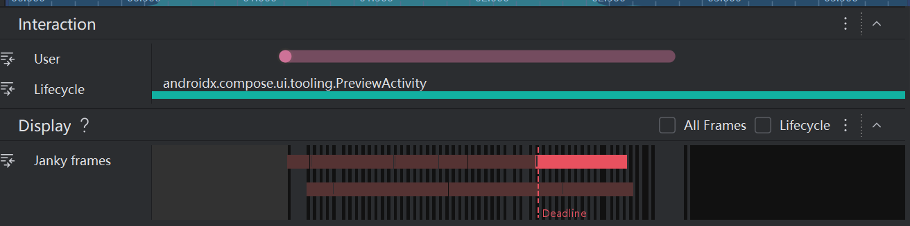
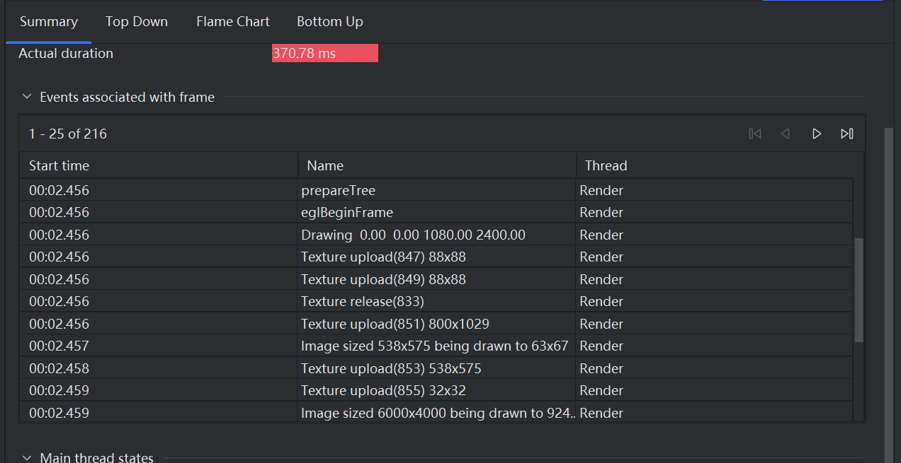

# bytedance-project

# 1. 项目背景

​	抖音图文业务的目标是建设一个能满足好普通人的内容创作与交流的 UGC 社区，解决好用户的经验决策、圈层交流类需求。UGC 强调内容的真实多元、作者的第一人称表达，相较于 PGC 类内容，更加多元，由普通人分享创作，因为每个人都有自己的生活方式，通过抖音双列及/可颂产品以内容与兴趣做好社区的人与人连接。

​	产品形态上，以双列图文视频混排，内容体裁以图文为主。双列区别于无限上下滑方式，双列的屏效比更高，一屏展示多个作品更能满足好用户的内容筛选与消费决策。图文体裁具有信息密度高、可控感强的优势，帮助用户更快速的进行内容消费与筛选，并且图文体裁内容创作成本低，利于普通用户的低门槛创作。

# 2. 技术方案选型

接下来将详细介绍每个模块选用的结构

如下图所示，展示了所有模块的基本结构

https://synxlab-ta.feishu.cn/docx/GcgUdSRCgowmYdxzWdKcdSiAn8f?openbrd=1&doc_app_id=501&blockId=doxcnmJkAofBWLx8e6dKPJd1fFe&blockType=whiteboard&blockToken=Ql9pwFmAThyQXybJUTQcOSqqnzf#doxcnmJkAofBWLx8e6dKPJd1fFe


# 3. 分模块设计与实现
## 3.1 关于底部导航栏的实现
首先封装一个`BottomNavItem`的密封类，然后我们定义出底部导航栏所需的五个元素分别为 **首页、朋友、相机、消息、我** 

然后接下来介绍`BottomNavigationBar`的具体实现，这个函数接受两个参数:当前所在的页面和一个接收`BottomNavItem`的函数

```kotlin
fun BottomNavigationBar(
    currentRoute: String,
    onItemSelected: (BottomNavItem) -> Unit
) {}
```

整体采用**Row**的布局方式，我们先定义一个包含了所有种类的list

```kotlin
val navItems = listOf(
    BottomNavItem.Home,
    BottomNavItem.Friends,
    BottomNavItem.Camera,
    BottomNavItem.Messages,
    BottomNavItem.Profile
)
```

然后使用`forEach`方法来遍历其中的每个`Item`，每个导航项使用`Box`来封装，权重都为1f，使其能均匀分布，这里需要注意的是，当遍历到相机这个模块的时候，我们不能显示出文字，而是显示出图片，所以需要`if-else`语句来判断遍历到的类型

```kotlin
if (item is BottomNavItem.Camera) {
    // Camera 显示图片
    Image(
        painter = painterResource(R.drawable.bottom1),
        contentDescription = item.title,
        modifier = Modifier.size(40.dp)
    )
} else {
    // 其他四个项目只显示文字
    Text(
        text = item.title,
        color = if (selected) Color.Black else Color.Gray,
        fontWeight = if (selected) FontWeight.Bold else FontWeight.Normal,
        fontSize = 17.sp
    )
}
```

这样一个底部导航栏就做好了

## 3.2 关于上部导航栏的实现

我们将上面的导航栏叫做`Hometabs`，创建这个组件，这个函数接收三个参数，和底部导航栏差不多，如下代码所示

```kotlin
fun HomeTabs(
    currentTab: String,
    onTabSelected: (String) -> Unit,
    modifier: Modifier = Modifier
){}
```

函数接受三个参数：当前位置，函数，还有一个缺省参数的`modifier`，同样，我们先定义一个list，里面有5个关键模块

```kotlin
val tabs = listOf("北京", "团购", "关注", "社区", "推荐")
```

众所周知，手机上面是有状态栏一项的，所以我们需要给他留出来，我们使用这段代码来获取状态栏的高度

```kotlin
val statusBarHeight = WindowInsets.statusBars.asPaddingValues().calculateTopPadding()

```

接下来整体采用Column布局，分为两个部分，一个是状态栏所站位的空间，另一个是上部导航栏。具体结构如下代码所示

```kotlin
Column(){
    Box()
    Row(){}
}
```

Box部分的实现逻辑较为简单，只需要传入**statusBarHeight**的高度然后采用透明的颜色即可

```kotlin
Box(
    modifier = Modifier
        .fillMaxWidth()
        .height(statusBarHeight)
        .background(Color.Transparent)
)
```

`Row`部分即使我们上部导航栏的主逻辑部分，经过我们使用figma测量它的高度为44dp，这里需要注意的是上部导航栏的最左和最右侧都有两个图标，然后中间夹着的是5个词语我们已经提前放到了`listof`里面，后面直接采用`forEach`来遍历即可。

上部导航栏的具体结构如下所示

```kotlin
Row{
    Image() //功能栏
    tabs.forEach{
        Box(){
            Text()
        }
    }
    Image() //搜索图标
}
```

关于两个图标的实现我们只需要调用存在`R.drawable`里面的两张图即可，调整好其大小以及距离即可。我们主要说一下两个图标中间的实现逻辑

我们先遍历之前创建的列表，如果他被选中了，我们就需要把字体颜色改成黑色并且还要在下面加上一根下划线，下划线如何实现呢？经过查询，我们可以使用`modifier`中的`drawBehind`中的`drawline`来实现，粗度设置为2f即可，如下代码所示

```kotlin
Text(
    text = tab,
    modifier = Modifier
        .padding(horizontal = 15.dp, vertical = 12.dp)
        .drawBehind {
            if (isSelected) {
                val lineWidth = size.width  // 使用完整宽度
                val startX = (size.width - lineWidth) / 2  // 从中间开始
                val lineBottom = size.height + 6.dp.toPx()
                drawLine(
                    color = Color.Black,
                    start = Offset(startX, lineBottom),
                    end = Offset(startX + lineWidth, lineBottom),
                    strokeWidth = 2f
                )
            }
        },
    color = if(isSelected) Color.Black else Color.Gray,
    fontWeight = if(isSelected) FontWeight.Bold else FontWeight.Normal,
    fontSize = 16.sp
)
```

## 3.3 关于双列瀑布流的实现

### 3.3.1 创建一些数据

我创建了一个Post.kt，用来保存每一个数据，里面定义一个数据类data class用来存储双列瀑布流中的每一个元素，具体存储的数据类型如下所示

```kotlin
data class Post(
    val id: String,
    val author: String,
    val avatarRes: Int,
    val imageResList: List<Int>, // 改为图片资源列表
    val title: String?,
    val content: String,
    val likeCount: Int,
    val imageAspectRatio: Float, // 图片宽高比
    val topics: List<String>,
    val createTime: Long 
)
```

这些就是我创建的一些数据，在此就展示一下不做过多解释

```kotlin
fun generateMockPosts(): List<Post> {
    val currentTime = System.currentTimeMillis()
    val oneDayMillis = 24 * 60 * 60 * 1000L
    val threeDaysMillis = 3 * oneDayMillis
    val sixDaysMillis = 6 * oneDayMillis
    val eightDaysMillis = 8 * oneDayMillis

    return listOf(
        Post(
            "1", "设计师小王", R.drawable.begin2,
            listOf(R.drawable.main1, R.drawable.main2, R.drawable.main3),
            "现代简约风格设计",
            "这次的设计采用了极简主义风格，注重空间利用和光线效果",
            156, 0.75f,
            listOf("设计", "极简主义", "室内设计", "装修"),
            currentTime - 2 * 60 * 60 * 1000 // 2小时前
        ),
        Post(
            "2", "摄影爱好者", R.drawable.begin2,
            listOf(R.drawable.main2),
            null,
            "今天在公园拍到了一只可爱的小松鼠，阳光正好，心情愉悦",
            89, 1.33f,
            listOf("摄影", "自然", "小动物", "公园随拍"),
            currentTime - 25 * 60 * 60 * 1000 // 25小时前（昨天）
        ),
        Post(
            "3", "美食博主", R.drawable.begin2,
            listOf(R.drawable.main3, R.drawable.main4),
            "家常菜分享",
            "红烧肉的做法很简单，关键是火候要掌握好",
            234, 0.8f,
            listOf("美食", "家常菜", "红烧肉", "烹饪技巧"),
            currentTime - threeDaysMillis // 3天前
        ),
        Post(
            "4", "旅行达人", R.drawable.begin2,
            listOf(R.drawable.main4, R.drawable.main5, R.drawable.main6),
            null,
            "西藏的星空真的太美了，仿佛触手可及",
            567, 1.25f,
            listOf("旅行", "西藏", "星空", "摄影", "高原风光"),
            currentTime - sixDaysMillis // 6天前
        ),
        Post(
            "5", "程序员日常", R.drawable.begin2,
            listOf(R.drawable.main5),
            "代码优化技巧分享",
            "分享几个提升代码性能的小技巧",
            78, 0.85f,
            listOf("编程", "代码优化", "性能", "技术分享"),
            currentTime - eightDaysMillis // 8天前
        ),
        Post(
            "6", "读书笔记", R.drawable.begin2,
            listOf(R.drawable.main6, R.drawable.main7),
            "《活着》读后感",
            "人生无常，珍惜当下，感恩拥有",
            145, 1.15f,
            listOf("读书", "活着", "余华", "文学", "人生感悟"),
            currentTime - 30 * oneDayMillis // 30天前
        ),
        Post(
            "7", "健身打卡", R.drawable.begin2,
            listOf(R.drawable.main7),
            null,
            "今天完成了10公里跑步，感觉整个人都轻松了",
            299, 0.9f,
            listOf("健身", "跑步", "运动", "健康生活"),
            currentTime - 12 * 60 * 60 * 1000 // 12小时前
        ),
        Post(
            "8", "宠物日常", R.drawable.begin2,
            listOf(R.drawable.main8, R.drawable.main1, R.drawable.main2, R.drawable.main3),
            "我家猫咪",
            "每天最幸福的事就是看着猫咪睡觉",
            432, 1.1f,
            listOf("宠物", "猫咪", "萌宠", "日常"),
            currentTime - 4 * oneDayMillis // 4天前
        )
    )
}
```

这里还是使用的listOf来保存所有的模拟数据的，方便从中取数据

### 3.3.2 创建作品卡片

作品卡片我们命名为PostCard，该可组合函数的参数有五个，分别是卡片所包含的信息post，是否点赞了，然后点击点赞和点击卡片所触发的回调函数，然后就是一个modifier，具体如下所示

```kotlin
@Composable
fun PostCard(
    post: Post,
    isLiked: Boolean,
    onLikeClick: (String) -> Unit,
    onPostClick: (Post) -> Unit,
    modifier: Modifier = Modifier
) {}
```

接下来我会具体拆解PostCard中的每一个部分来详细阐述其组成

首先整个卡片我们使用Card来包含，并且设置其为圆角也要加上点击时触发的回调函数，就是进入详情页面的回调函数

```kotlin
Card(
    modifier = modifier
        .fillMaxWidth()
        .clickable{ onPostClick(post) },
    shape = MaterialTheme.shapes.medium, //设置卡片的圆角形状
    //设置卡片轻微阴影效果
    elevation = CardDefaults.cardElevation(defaultElevation = 2.dp)
) {}
```

需要注意的是，Card内部中的元素是呈列状来表示的，我们首先使用Box来封装展示的图片，里面使用了**`coerceIn`**来限制图片的宽高比，其中的0.75f和1.33f表示宽高比限制在 `3:4` ~ `4:3` 之间

```kotlin
Box(
    modifier = Modifier
        .fillMaxWidth()
        .aspectRatio(post.imageAspectRatio.coerceIn(0.75f, 1.33f)) //限制宽高比在指定范围内
) {
    Image()
}
```

图片下面的内容，就是具体的作品内容区域，作品内容包含以下元素，作品的标题或者叫做正文和作者的信息以及点赞数目。后者我们选择采用Row来布局，作者头像、昵称和点赞数量是排列在一排的，直接用Row布局会非常的方便


```kotlin
//作者信息以及点赞
Row(
    modifier = Modifier.fillMaxWidth(),
    horizontalArrangement = Arrangement.SpaceBetween,
    verticalAlignment = Alignment.CenterVertically
) {
    //作者头像和昵称
    Row(
        verticalAlignment = Alignment.CenterVertically
    ) {
        Image(
            painter = painterResource(id = post.avatarRes),
            contentDescription = "作者头像",
            modifier = Modifier
                .size(24.dp)
                .clip(CircleShape), //圆形裁剪
            contentScale = ContentScale.Crop //缩放模式,图片充满圆形区域不会变形
        )
        Spacer(modifier = Modifier.width(8.dp))
        Text(
            text = post.author,
            style = MaterialTheme.typography.labelSmall,
            maxLines = 1,
            overflow = TextOverflow.Ellipsis,
            color = Color.Gray
        )
    }
    //点赞图标和数量
    Row(
        verticalAlignment = Alignment.CenterVertically,
        modifier = Modifier
            .clickable { onLikeClick(post.id) }
            .padding(4.dp)
    ) {
        Icon(
            imageVector = if(isLiked) Icons.Filled.Favorite else Icons.Outlined.Favorite,
            contentDescription = if(isLiked) "取消点赞" else "点赞",
            tint = if(isLiked) Color.Red else Color.Gray,
            modifier = Modifier.size(18.dp)
        )
        Spacer(modifier = Modifier.width(4.dp))
        Text(
            text = formatCount(post.likeCount + if(isLiked) 1 else 0),
            style = MaterialTheme.typography.labelSmall,
            color = if(isLiked) Color.Red else Color.Gray //点击了就呈现红色心心
        )
    }
}
```

并且需要注意的是，我们如何实现文字溢出的时候其余文字用`...`来表示，其实很简单，在Text的属性中增加一个属性**`overflow = TextOverflow.Ellipsis`**，即可。然后关于点赞数量，如果超出了我们可以用k(千),w(万)来表示，避免溢出

```kotlin
private fun formatCount(count: Int): String {
    return when {
        count >= 10000 -> "${count / 10000}w"
        count >= 1000 -> "${count / 1000}k"
        else -> count.toString()
    }
}
```

### 3.3.3 双列瀑布流的三种状态

- EmptyState 空状态
- LoadingState 加载状态
- LoadMoreState 加载更多状态

首先是空状态，空状态是用来表示加载失败的一种情况，由一个图标和文字（加载失败）以及重新加载的按钮组成，逻辑较为简单

```kotlin
Column(
    modifier = modifier,
    horizontalAlignment = Alignment.CenterHorizontally,
    verticalArrangement = Arrangement.Center
) {
    Icon()
    Spacer(modifier = Modifier.height(16.dp))
    Text()
    Spacer(modifier = Modifier.height(8.dp))
    Button() {
        Text("重新加载")
    }
}
```

然后就是加载状态，加载状态我们就呈现出一个加载的圆圈然后圆圈下面呈现出加载中的文字即可

``` kotlin

Box(
    modifier = modifier,
    contentAlignment = Alignment.Center
) {
    Column(
        horizontalAlignment = Alignment.CenterHorizontally
    ) {
        //加载的组件，用于展示加载的圆圈
        CircularProgressIndicator()
        Spacer(modifier = Modifier.height(16.dp))
        //圆圈下面所呈现的文字
        Text()
    }
}

```

最后就是加载更多状态，当下拉双列瀑布流时，会出现一个圆圈用来表示加载更多的状态

```kotlin
fun LoadMoreState() {
    Box(
        modifier = Modifier
            .fillMaxWidth()
            .padding(16.dp),
        contentAlignment = Alignment.Center
    ){
        CircularProgressIndicator(
            modifier = Modifier.size(24.dp),
            strokeWidth = 2.dp
        )
    }
}
```

### 3.3.4 管理点赞的类LikeManager

之前的第二节课老师讲了，使用键值对来存储信息，存储到`SharedPreferences`里面，这次我们管理点赞数量也使用这种方法，我们讲这个管理点赞的类命名为`LikeManager`，接下来详细介绍其成员函数

其中的成员函数有两个：`getLikedPosts()`和`toggleLike()` 。两个函数的作用分别用来获取用户所有点赞过的帖子集合以及用于切换点赞状态。

`getLikedPosts()`主要逻辑是从`SharedPerferences`中获取点赞的帖子的点赞数目的

```kotlin
fun getLikedPosts(): Set<String> {
    return sharedPreferences.getStringSet("liked_posts", mutableSetOf()) ?: mutableSetOf()
}
```

`toggleLike()`主要逻辑是用户点赞了就把点赞过的帖子的名字放进去，取消点赞的从`SharedPreferences`取出

```kotlin
//用于切换点赞状态
fun toggleLike(postId: String) {
    val currentLiked = getLikedPosts().toMutableSet() //转化为可变的set
    if(currentLiked.contains(postId)) {
        currentLiked.remove(postId)
    }else{
        currentLiked.add(postId)
    }
    sharedPreferences.edit().putStringSet("liked_posts", currentLiked).apply()
}
```

### 3.3.5 双列瀑布流展示的核心逻辑HomeScreen

首先展示一下函数声明与参数

```kotlin
@Composable
fun HomeScreen(
    currentTab: String,        // 当前选中的标签
    onTabSelected: (String) -> Unit, // 标签选择回调
    modifier: Modifier = Modifier
)
```

各个参数的作用已经注释到上面了，后面如果选择了其中的一个标签就会展示其详细内容，现在尚且没有实现，后面的3.4部分将会去实现

然后我创建了几个参数分别用于状态管理和点赞管理

```kotlin
// 各种状态管理变量
var posts by remember { mutableStateOf(emptyList<Post>()) } // 帖子列表数据
var isLoading by remember { mutableStateOf(true) }          // 初始加载状态
var isRefreshing by remember { mutableStateOf(false) }      // 下拉刷新状态
var isLoadingMore by remember { mutableStateOf(false) }     // 加载更多状态
var hasError by remember { mutableStateOf(false) }          // 错误状态
var currentPage by remember { mutableStateOf(1) }           // 当前页码

// 点赞功能管理
val likeManager = rememberLikeManager()
var likedPosts by remember { mutableStateOf(likeManager.getLikedPosts()) }
```

接下来这个函数用来实现下拉刷新功能

```kotlin
val pullRefreshState = rememberPullRefreshState(
    refreshing = isRefreshing,
    onRefresh = {
        isRefreshing = true
        coroutineScope.launch {
            delay(1500) // 模拟网络请求
            posts = generateMockPosts().shuffled() // 刷新数据
            isRefreshing = false
            currentPage = 1
        }
    }
)
```

这里的rememberPullRefreshState是Compose中用于创建下拉刷新状态的函数，我们这里先用把之前准备的数据shuffeled来模拟刷新，然后重置页数

显示之前我们需要初始数据加载

```kotlin
LaunchedEffect(Unit) {
    loadInitialData(
        onLoading = { isLoading = true },
        onSuccess = { data ->
            posts = data        // 加载成功，更新帖子列表
            isLoading = false   // 关闭加载状态
            hasError = false    // 重置错误状态
        },
        onError = {
            isLoading = false
            hasError = true     // 显示错误状态
        }
    )
}
```

需要注意的是这里使用的是`LaunchedEffect`来实现的初始数据加载，里面的代码只会在组件首次组合时执行一次，里面设置了各种回调函数

如果滚动到列表末尾，需要加载更多的数据，这里我们使用的是`rememberLazyStaggeredGridState()`来监听列表滚动，在LaunchedEffect中传入listState参数(监听的列表滚动)，当listState变化时，LaunchedEffect会取消之前的协程，重新启动新的协程，具体实现代码如下所示

```kotlin
 //监听列表滚动，实现更多的加载
val listState = rememberLazyStaggeredGridState()
LaunchedEffect(listState) {
    snapshotFlow { listState.layoutInfo.visibleItemsInfo } // 将可见项信息转换为 Flow
        .collect { visibleItems ->
            if(visibleItems.isNotEmpty() &&
                visibleItems.last().index >= posts.size - 3 &&
                !isLoadingMore && !hasError) {
                loadMoreData(
                    currentPage = currentPage,
                    onLoading = { isLoadingMore = true },
                    onSuccess = { newPosts ->
                        posts = posts + newPosts
                        isLoadingMore = false
                        currentPage++
                    },
                    onError = {
                        isLoadingMore = false
                    }
                )
            }
        }
}
```

下面便是上部导航栏和瀑布双列表在手机上展示出来的具体代码

我们把HomeTabs和具体的内容区域放到Column里面即可

```kotlin
Column(modifier = modifier) {
    HomeTabs() //上部导航栏区域
    Box() //内容区域
}
```

接下来讲解一下`Box()`的具体组成

```kotlin
Box(modifier = Modifier.fillMaxSize()) {
    when {
        // 状态1: 错误且无数据
        hasError && posts.isEmpty() -> { ... }
        
        // 状态2: 加载中且无数据  
        isLoading && posts.isEmpty() -> { ... }
        
        // 状态3: 正常显示内容
        else -> { ... }
    }
}
```

这里只走了正常显示内容的这一条逻辑，非常方便的是，Compose提供了LazyVerticalStaggeredGrid组件来供我们来实现瀑布流网格布局，需要传入参数columns = StaggeredGridCells.Fixed(2)表示的是我们需要两个布局，大括号中则具体展示了整个瀑布流的实现逻辑，我们直接使用itemsIndexed来遍历每一个内容，然后使用PostCard展示出我们的瀑布流

```kotlin
//这里是内容区域
Box(modifier = Modifier.fillMaxSize()) {
    when {
        hasError && posts.isEmpty() -> {...}
        isLoading && posts.isEmpty() -> {...}
        else -> {
            //下拉刷新和瀑布流
            Box(
                modifier = Modifier
                    .fillMaxSize()
                    .pullRefresh(pullRefreshState)
            ) {
                LazyVerticalStaggeredGrid(
                    columns = StaggeredGridCells.Fixed(2),
                    state = listState,
                    modifier = Modifier
                        .fillMaxSize()
                        .background(Color(0xFFF5F5F5)),
                    horizontalArrangement = Arrangement.spacedBy(8.dp),
                    verticalItemSpacing = 8.dp,
                    contentPadding = PaddingValues(8.dp)
                ) {
                    //遍历帖子列表
                    itemsIndexed(posts) {index, post ->
                        val isLiked = likedPosts.contains(post.id)

                        PostCard(
                            post = post,
                            isLiked = isLiked,
                            onLikeClick = { postId ->
                                likeManager.toggleLike(postId)
                                likedPosts = likeManager.getLikedPosts()
                            },
                            onPostClick = { clickdPost ->
                                //处理帖子点击
                            },
                            modifier = Modifier.fillMaxWidth()
                        )
                    }
                    if(isLoadingMore){
                        item {
                            LoadMoreState()
                        }
                    }
                }
                //下拉刷新指示器
                PullRefreshIndicator(
                    refreshing = isRefreshing,
                    state = pullRefreshState,
                    modifier = Modifier.align(Alignment.TopCenter)
                )
            }
        }
    }
}
```

## 3.4 关于帖子详情页的实现

### 3.4.1 顶部作者区的实现

整体采用Row布局来实现的顶部作者区，从左到右分别为：<（返回Icon）、作者头像&昵称、关注按钮，实现逻辑较为简单，一次放入Row布局即可，这里只给出具体结构，就不给出具体实现细节了

```kotlin
Row(
    modifier = modifier,
    verticalAlignment = Alignment.CenterVertically
) {
    //返回按钮
    IconButton(onClick = onBackClick) {
        Icon()
    }
    //作者信息
    Row() {
        Image()
        Spacer(modifier = Modifier.width(8.dp))
        Text()
    }
    //关注按钮
    IconButton() {
        Image()
    }
}
```

### 3.4.2 底部交互区的实现

同样如此，底部交互区也使用Row来布局，首先是快捷评论区，选择的是Box布局来实现的，接下来就是四个分享的按钮，我们都是用IconButton类实现的，然后其中文档上面要求是点赞按钮和分享按钮是需要有交互的，只需要点击点赞按钮的时候点赞数目加一心心变红，点击分享按钮的时候分享数目加一即可。同样，整体采用Row来布局，Row里面从左到右依次是快捷评论框，点赞按钮和计数、评论按钮和计数、收藏按钮和计数、分享按钮和计数。其中的每一个按钮合计数都使用Column布局来实现。下面是底部交互区的实现结构

```kotlin
@Composable
private fun BottomInteractionBar(
    isLiked: Boolean,
    onLikeClick: () -> Unit,
    onCommentClick: () -> Unit,
    onCollectionClick: () -> Unit,
    onSharedClick: () -> Unit,
    modifier: Modifier = Modifier
) {
    Row() {
        //快捷评论框
        Box() {
            Text()
        }
        Spacer(modifier = Modifier.width(12.dp))

        // 点赞按钮和计数
        Column() {
            IconButton() {}
            Text()
        }

        Spacer(modifier = Modifier.width(8.dp))

        // 评论按钮和计数
        Column() {
            IconButton() {}
            Text()
        }

        Spacer(modifier = Modifier.width(8.dp))

        // 收藏按钮和计数
        Column() {
            IconButton() {}
            Text()
        }

        Spacer(modifier = Modifier.width(8.dp))

        // 分享按钮和计数
        Column() {
            IconButton() {}
            Text()
        }
        
    }
}
```

### 3.4.3 横滑容器的实现

整个横滑容器组件，我命名为`ImageSwiper`，具体实现逻辑是，先创建`rememberPagerState`，来记住`Pager`的状态。然后使用`LaunchedEffect`监听 `pagerState.currentPage` 的变化，每当用户滑动切换图片的时候，就会调用`onIndexChange`回调更新外部状态。最核心的组件就是`HorizontalPager`，即水平翻页器，在里面创建一个Image组件然后遍历即可完成、整个横滑容器

```kotlin
private fun ImageSwiper(
    imageResList: List<Int>, // 图片资源ID列表
    currentIndex: Int, // 当前显示的图片索引
    onIndexChange: (Int) -> Unit, // 当图片切换时的回调函数
    modifier: Modifier = Modifier
) {
    val pagerState = rememberPagerState(
        initialPage = currentIndex,
        pageCount = { imageResList.size }
    )
    //同步pager状态和外部状态
    LaunchedEffect(pagerState.currentPage) {
        onIndexChange(pagerState.currentPage)
    }

    HorizontalPager(
        state = pagerState,
        modifier = modifier
    ) { page ->
        Image(
            painter = painterResource(id = imageResList[page]),
            contentDescription = "帖子图片",
            contentScale = ContentScale.Crop,
            modifier = Modifier.fillMaxSize()
        )
    }
}
```

### 3.4.4 进度条的实现

进度条我是使用`FullWidthProgressIndicator`这个函数来实现的，这样取名字是因为这个进度条要占满图片的宽度，按照图片的数目进行平分，总体采用一个`Row`布局即可，然后每个进度条用一个`Box`装起来。

```kotlin
@Composable
private fun FullWidthProgressIndicator(
    total: Int, // 总图片数
    current: Int, // 当前进度位置
    modifier: Modifier = Modifier
) {
    Row() {
        repeat(total) { index ->
            Box()
            )
        }
    }
}
```

### 3.4.5 标题区+正文区+发布日期的实现

首先是标题区，这个的实现较为简单，我们需要判空一下，不为空的时候才展示出标题来，具体代码如下所示

```kotlin
// title是可空的
post.title?.let { title ->
    Text(
        text = title,
        style = MaterialTheme.typography.titleMedium,
        fontWeight = FontWeight.Bold,
        modifier = Modifier.fillMaxWidth()
    )
    Spacer(modifier = Modifier.height(12.dp))
}
```

正文区的实现使用Text组件较为方便，可以完美显示正文且不会截断

```kotlin
// 正文
Text(
    text = post.content,
    style = MaterialTheme.typography.bodyMedium,
    modifier = Modifier.fillMaxWidth()
)
```

这个部分主要是话题区域部分，我们需要以蓝黑色显示话题词并且支持点击话题词进入话题词详情页面的功能，这里就简单实现了，跳转的页面可能看起来有点简陋。我把话题词全部放入了`post`的`topic`参数里面，这个`topic`是一个`List<String>`类型，我们展示话题词的时候，只需要使用`forEach`来遍历这个`topic`即可。然后点击这个`topic`的时候添加回调函数，使之能跳转到话题词页面

```kotlin
// 话题词 - 显示在正文末尾
if (post.topics.isNotEmpty()) {
    FlowRow(
        modifier = Modifier.fillMaxWidth(),
        horizontalArrangement = Arrangement.spacedBy(8.dp),
        verticalArrangement = Arrangement.spacedBy(4.dp)
    ) {
        post.topics.forEach { topic ->
            Text(
                text = "#$topic",
                color = Color(0xFF04498D),
                style = MaterialTheme.typography.labelMedium,
                modifier = Modifier
                    .clickable {
                        // 处理话题点击，跳转到话题页面
                        onTopicClick(topic)
                    }
                    .padding(vertical = 2.dp)
            )
        }
    }
    Spacer(modifier = Modifier.height(12.dp))
}
```

最后便是发布日期的展示，这个需要根据离现在不同的时间来展示不同的发布日期，所以我选择使用时间戳来判断是使用哪种形式的发布日期

我使用了一个`formatPostDate`的函数来解决这个问题，其参数`createTime`中传入时间戳，根据时间戳返回不同的数据

```kotlin
private fun formatPostDate(createTime: Long): String {
    val currentTime = System.currentTimeMillis()
    val diff = currentTime - createTime
    val days = diff / (24 * 60 * 60 * 1000)
    val hours = diff / (60 * 60 * 1000)
    val minutes = diff / (60 * 1000)

    return when {
        minutes < 1 -> "刚刚"
        hours < 1 -> "${minutes}分钟前" // 1小时内显示分钟
        hours < 24 -> {
            // 24小时内显示具体时间或"昨天"
            val calendar = Calendar.getInstance().apply { timeInMillis = createTime }
            val currentCalendar = Calendar.getInstance()

            if (currentCalendar.get(Calendar.DAY_OF_YEAR) == calendar.get(Calendar.DAY_OF_YEAR) &&
                currentCalendar.get(Calendar.YEAR) == calendar.get(Calendar.YEAR)) {
                // 同一天显示具体时间
                SimpleDateFormat("HH:mm", Locale.getDefault()).format(Date(createTime))
            } else {
                // 昨天显示"昨天 + 时间"
                "昨天 ${SimpleDateFormat("HH:mm", Locale.getDefault()).format(Date(createTime))}"
            }
        }
        days < 7 -> "${days}天前" // 7天内显示天数
        else -> SimpleDateFormat("MM-dd", Locale.getDefault()).format(Date(createTime)) // 其他显示具体日期
    }
}
```

使用一个`when`来选择感觉是最方便的写法

# 4. 技术难点和解决方案

## 4.1 关于上部导航栏的下划线的实现

我们需要使用`Modifier.drawLBehind`来实现此功能,`drawBehind`里面有一个成员`drawLine`来实现此功能。

## 4.2 关于双列瀑布流滑动有些卡顿的问题

我之前选用的方案是对双列瀑布流中的每一个`PostCard`进行监听，然后滑动到底部的时候触发加载更多的功能，然后我就换成了只对其中一个`PostCard`进行监听的方案，卡顿问题得到一些解决

## 4.3 关于双列瀑布流还是有些卡顿的进一步尝试

前面已经说过，双列瀑布流的已经尝试过解决，但是还是存在一些卡顿，所以我尝试在官网上找教程来解决这个问题。

官方文档链接：[界面卡顿检测  | Android Studio  | Android Developers](https://developer.android.google.cn/studio/profile/jank-detection?hl=zh-cn&authuser=3)

首先我们可以打开IDE的Profiler，然后运行我的程序，程序开始运行的时候，滑动一下双列瀑布流之后，然后点结束过几秒就会看到众多表之中有一个叫做 **Janky frames** 轨道。**在每个卡顿帧中，红色部分突出显示了相应帧超出其渲染截止时间的时长。**



如上图所示，这些红色部分都是卡顿的来源。我们选中其中一个卡顿帧，然后按M聚集到该帧，相关事件就会在以下线程中突出显示：主线程、`RenderThread`和 `GPU completion`

- 主线程卡顿：通常是因为在主线程执行了**耗时操作**，如密集计算、磁盘I/O、网络请求等，导致UI无法及时响应。这是最常见卡顿原因
- `RenderThread`卡顿：通常与复杂的UI绘制指令有关，如复杂的`Canvas`操作、路径绘制、大量的层叠裁剪等
- `GPU Completion`卡顿: 通常称为“**过度绘制**”或“**GPU瓶颈**”。原因是GPU负载过重，例如：屏幕上有太多层重叠的视图、复杂的着色器、大尺寸的半透明图像混合等，导致它无法在16.6ms（60Hz屏幕）内完成绘制。

经过查询发现，我的代码当中有大量的纹理加载（经过了解这是一个非常耗时的操作），而且我把图片的加载放到了主线程中，我应该选择将图片使用异步加载的方式并且同时实现预加载两种加载的方式去解决这个滑动卡顿的问题。下图呈现了我是怎么看出来是纹理加载引起的问题



如上图所示，里面有大量的`Texture upload`，也就是纹理加载太多了所导致的问题。所以接下来我将叙述我是如何实现图片异步加载 + 预加载以及一些其他小优化的解决方案

### 4.3.1 异步加载

我最开始使用的是`Image`这个展示图片的组件，但是这个组件有很大的问题，就是会阻塞主线程，加载图片的时间太长了阻塞了主线程，所以把`PostCard`中所有的`Image`全部换成了`AsyncImage`，异步加载图片，会大幅度解决卡顿的问题

```kotlin
//作品封面异步加载
AsyncImage(
    model = post.imageResList[0], // 直接传资源ID
    contentDescription = "作品封面",
    modifier = Modifier.fillMaxSize(),
    contentScale = ContentScale.Crop
)

//作者头像异步加载
AsyncImage(
    model = post.avatarRes,
    contentDescription = "作者头像",
    modifier = Modifier
        .size(24.dp)
        .clip(CircleShape), //圆形裁剪
    contentScale = ContentScale.Crop //缩放模式,图片充满圆形区域不会变形
)
```

### 4.3.2 预加载

首先我创建了一个叫做`ImageLoaderManager`的图片加载管理器，主要提供了三个功能：1. 统一管理`ImageLoader`实例 2. 配置图片缓存策略 3.提供图片预加载功能

我们采用单例模式，并且只有使用这个类的时候才会创建实例也就是懒汉模式

```kotlin
object ImageLoaderManager {  // object 声明表示单例
    private var imageloader: ImageLoader? = null  // 懒加载实例

    fun getImageLoader(context: Context): ImageLoader {
        return imageloader ?: createImageLoader(context).also {
            imageloader = it  // 双重检查锁定模式
        }
    }
}
```

然后便是创建图片加载管理器的主逻辑

```kotlin
private fun createImageLoader(context: Context): ImageLoader {
    return ImageLoader.Builder(context)
        // 内存缓存：存储 Bitmap 在内存中
        .memoryCache {
            MemoryCache.Builder(context)
                .maxSizePercent(0.3) // 使用30%的最大可用内存
                .weakReferencesEnabled(true) // 内存不足时自动清理
                .build()
        }
        // 磁盘缓存：存储原始图片数据在存储中
        .diskCache {
            DiskCache.Builder()
                .directory(context.cacheDir.resolve("image_cache"))
                .maxSizeBytes(300 * 1024 * 1024) // 300MB 缓存空间
                .build()
        }
        .respectCacheHeaders(false) // 忽略服务器的缓存头，优先使用本地缓存
        .crossfade(true) // 图片加载时淡入动画
        .allowHardware(true) // 使用硬件加速渲染
        .build()
}
```

`preloadImage`是我用来预加载单张图片的函数，我采用的是在IO线程执行预加载的操作，这样操作不会阻塞主线程。同时也是用了两级缓存的方案，以实现性能和用户体验的最大化

```kotlin
suspend fun preloadImage(
    context: Context,
    data: Any,
    width: Int = 0,
    height: Int = 0
) = withContext(Dispatchers.IO) {
    try {
        val request = ImageRequest.Builder(context)
            .data(data)
            .size(if(width > 0 && height > 0) Size(width, height) else Size.ORIGINAL)
            .memoryCachePolicy(CachePolicy.ENABLED)
            .diskCachePolicy(CachePolicy.ENABLED)
            .build()

        getImageLoader(context).enqueue(request) //加入队列异步执行
    } catch (e: Exception) {
        //静默失败不影响主流程
    }
}
```

然后我们就可以把这些预加载的函数加入到`HomeScreen`中以实现预加载主逻辑。`LaunchedEffect`会监听他里面参数，里面的参数发生变化的时候会重新启动协程。`snapshotFlow`将返回预加载的索引范围。然后`collect`会进行预加载主逻辑

```kotlin
 LaunchedEffect(listState, posts) {
    snapshotFlow {
        val layoutInfo = listState.layoutInfo
        val visibleIndices = layoutInfo.visibleItemsInfo.map { it.index }

        //获取预加载范围: 可见区域前后3项
        val preloadStart = (visibleIndices.minOrNull() ?: 0) - 3
        val preloadEnd = (visibleIndices.maxOrNull() ?: 0) + 3

        //只预加载实际存在的索引
        preloadStart..preloadEnd
    }
        .distinctUntilChanged()
        //添加防抖，减少频繁触发
        .debounce(16)
        .collect { preloadRange ->
            // 在IO线程执行预加载，不阻塞主线程
            // 使用低优先级调度器，避免与UI竞争CPU
            withContext(Dispatchers.IO.limitedParallelism(2)) {
                preloadRange.forEach { index ->
                    if(index in posts.indices) {
                        val post = posts[index]
                        //只预加载第一张图片
                        if(post.imageResList.isNotEmpty()) {
                            // 简化预加载，不传尺寸参数
                            ImageLoaderManager.preloadImage(
                                context = context,
                                data = post.imageResList[0]
                            )
                        }
                    }
                }
            }
        }
    }
```

### 4.3.3 其他优化

- 优化1：使用更小的圆角，减少CircularRRectOp
  ```kotlin
   shape = MaterialTheme.shapes.small
  ```

- 优化2：移除阴影，消除ShadowCircularRRectOp
  ```kotlin
  elevation = CardDefaults.cardElevation(defaultElevation = 0.dp) // 改为0dp
  ```

- 优化3：直接使用AsyncImage作为作品封面逻辑不使用Box对齐再进行包装
  ```kotlin
  // 作品封面逻辑
  AsyncImage(
      model = post.imageResList[0], // 直接传资源ID
      contentDescription = "作品封面",
      modifier = Modifier
          .fillMaxWidth()
          .aspectRatio(post.imageAspectRatio.coerceIn(0.75f, 1.33f)),
      contentScale = ContentScale.Crop
  )
  ```

- 优化4：减小内边距
  ```kotlin
  // 作品内容区域
  Column(
      // 优化4：减小内边距
      modifier = Modifier.padding(8.dp)
  ){}
  ```

- 优化5：简化字体样式
  ```kotlin
  style = MaterialTheme.typography.bodyMedium.copy(
      fontWeight = if (post.title != null) FontWeight.Medium else FontWeight.Normal,
      lineHeight = 18.sp // 减小行高
  )
  ```

- 优化6：移除内边距，减少FillRectOp
  ```kotlin
  modifier = Modifier
      .clickable { onLikeClick(post.id) }
  ```

- 优化7：使用Icon替代Image，减少纹理操作
  ```kotlin
  Icon(
      painter = painterResource(id = if (isLiked) R.drawable.like else R.drawable.notlike),
      contentDescription = if (isLiked) "取消点赞" else "点赞",
      tint = if (isLiked) Color.Red else Color(0xFF666666),
      modifier = Modifier.size(16.dp) // 减小尺寸
  )
  ```